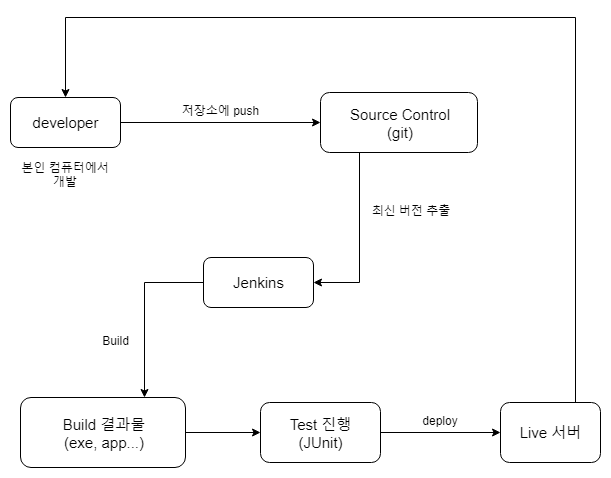

# Jenkins

##### 2019. 06. 20 (Thur)

 

#### Jenkins?

지속적인 통합 CI(Continuous Integration)과 지속적 배포(Continuous Deployment, CD)를 위한 도구

빌드, 테스트, 배포 프로세스를 자동화하여 생산성을 높일 수 있고, 소스 변경사항을 프로젝트에 지속적으로 통합

자바(Java)를 기반으로 만들어 졌으며 Open source

다양한 플러그인을 제공하며, subversion, git등 소스 툴과 Maven, Gradle등 빌드 툴을 지원한다.

 

 

#### Jenkins를 쓰지 않는 기존 방식

1. 수정사항을 Git(원격 저장소)에 push
2. 로컬 환경에서 프로젝트 빌드
3. 빌드를 완료한 결과물을 테스트 서버로 전송
4. 배포 스크립트를 통해 배포
5. 테스트 진행
6. 완료된 버전을 release 브랜치에 push
7. 로컬 환경에서 프로젝트 빌드
8. 다시 빌드된 결과물을 중앙 관리 서버로 전송
9. 중앙 배포 스크립트를 실행하여 QA서버로 복사, 배포
10. QA진행
11. 중앙 배포 스크립트를 실행하여 Product로 복사, 배포

 

 

### github와 연동

 

 

### 참고 자료

<https://jojoldu.tistory.com/139>

